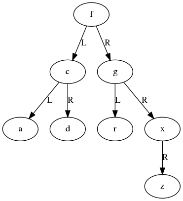

Q1 - Balancing Trees
====================


Background
==========

Binary sorted trees are relatively simple linked data-structures,
but may become un-balanced, causing performance to degrade to
that of a linked-list. One approach is to incrementally balance
the tree while inserting and deleting each node, making each
insertion and deletion more complicated and slightly slower.
Another option is to completely reconstruct the tree once it
becomes sufficiently imbalanced, creating a new tree that
is either perfectly or approximately balanced. This means that
some insertions and deletions may be much slower, while the
typical insertion or deletion is simpler and slightly faster.
This question explores the second option of occasionally
reconstructing the tree.

Tree nodes
----------

The underlying data primitive used in this question is `tree_node`,
which is defined in `tree_node.hpp`
```
struct tree_node
{
    string value;
    tree_node *left;
    tree_node *right;
};
```
This structure is a standard binary search tree, as seen in lectures.

This particular tree only stores values, so it models a mathematical set,
and each value should appear at most once in a set.

The `Set` class
---------------

The `StringSet` class in `string_set.hpp` provides a high-level interface
for a set of strings. The main functions are:

- `insert` : Add a new string to the underlying tree (if it doesn't already exist).
- `contains` : Check whether the set contains a given string.
- `optimise` : An optional method which tells implementations to spend time optimising the data structure for performance.
- `root` : Returns a read-only view to the root of the tree underlying the set.

Implementations of this class are created using the factory function `create_string_set`.

Measuring Tree balance
----------------------

In a balanced binary tree containing `n` nodes the left and
right sub-tree would contain around `(n-1)/2` nodes each. Applied
recursively, this means the optimal height (number of levels) of a
tree with `n` nodes is `ceiling(log2(n+1))`. In the worst case a
completely unbalanced tree will degrade into a linked-list with height `n`.

Given the nodes `n` and height `h` for a tree, a basic metric
of balance is:
```
b = ( h / h_opt - 1 ) / ( n / h_opt - 1 ),
    where h_opt = ceiling(log2(n+1))
```
This metric is 0 if the tree is perfectly balanced, and 1 if
the tree is maximally unbalanced. For example, with `n=10`
nodes we get `h_opt = 4`, and for different observed tree
heights `h` we get:

h  |  b
---|-----
3  | 0.000
5  | 0.333
8  | 0.666
10 | 1.000


Reconstructing the tree in-place
--------------------------------

Given an existing binary search tree, we can reconstruct it
simply by traversing the existing tree, while building a completely new
tree alongside the original. The existing tree can then be freed using
`delete`, and replaced with the new tree. However, this means that
there will be many calls to `new`, plus we have to keep making copies of
the node's value, both of which can be relatively expensive operations.

Much more efficient is to keep all the nodes from the original tree,
and reconstruct the tree "in place", re-using the existing nodes but
changing the links between them. This avoids re-allocating memory
and copying the node values, and means that we only need to do cheap
pointer manipulation.

The tree re-balancing then follows these steps:

1. Create an empty working vector of pointers to tree nodes.
2. Visit each node in the tree, and insert a pointer to each node into the working vector.
3. Turn the nodes in the working vector into a new binary search tree, over-writing the existing left and right pointers.
4. Return the new root node.

The main choices come in steps 2. and 3. - how do we visit all the nodes in the tree,
and how do we turn the vector back into a binary search tree?

Node visiting and collection
-----------------------------

One method of visiting and collecting the nodes in a tree is an in-order traversal,
where we visit left children, then the node, then right children:
```
function collect_in_order(working_vec, node)
begin
   if empty(node) begin
       return
   end
   collect_in_order( working_vec, left(node) )
   working_vec.append( node )
   collect_in_order( working_vec, right(node) )
end
```
This assumes that `working_vec` is passed by reference, and so can be modified
in place. Note that this is pseudo-code being used to describe an algorithm, and
so will require adaptation to implement in   C++.

Visiting in-order ensures that all nodes are visited once. It also produces
a vector where all the nodes appear in correct value order, because we insert
everything in the left sub-tree before everything in the right sub-tree.

True re-balancing
-----------------

An advantage of building a vector of nodes using in-order traversal
is that the nodes in the vector will appear in the correct order. We
can exploit this to build a balanced tree, as the root of the tree
should ideally be the "middle" value in the set, with equal numbers
of values which are smaller and larger. The middle value in the working
vector will simply be the node half-way through the vector of in-order
nodes. This approach can be applied recursively, balancing
the left and sub-trees in the same way.

Pseudo-code for this process is:
```
function build_balanced(node_vec, begin, end)
begin
    root = Empty
    if begin < end then
        mid = (begin+end)/2
        root = node_vec[mid]
        set_left( root, build_balanced(node_vec, begin, mid) )
        set_right( root, build_balanced(node_vec, mid+1, end) )
    end if
    return root
end
```

Random re-balancing
-------------------

Another simple approach to turn the vector of nodes back into a tree is just to
insert them back into the tree in a random order. This does not guarantee
that the tree is balanced, but on average it is likely to be fairly well balanced,
and is very unlikely to degrade into an extremely unbalanced tree.

This re-balancing approach is fully implemented in `tree_rebuild_random`, which
takes the original root node plus a random number generator object, re-builds
the tree randomly, and returns a new root. This implementation is purely to
give one example of rebalancing, and you do not need to change it.

Visualising graphs
------------------

It is often useful to visualise data-structures in order to understand
the structure of the tree, and where specific values end up in the tree.
(Graphviz)[https://graphviz.org/] is a set of tools for visualising linked data,
and uses a very simple input format called `dot` to describe graphs. The
following is a `dot` description of a binary search tree with 6 nodes
containing the values `c`, `f`, `g`, `r`, `x`, `z`:
```
digraph G7 {
    "f" -> "c" [label="L"];
    "f" -> "g" [label="R"];

    "c" -> "a" [label="L"];
    "c" -> "d" [label="R"];

    "g" -> "r" [label="L"];
    "g" -> "x" [label="R"];

    "x" -> "z" [label="R"];
}
```

Each line of the form `"A" -> "B"` establishes that there is a pointer
from the node with value `A` to the node with value `B`. The
attribute `[label="L"]` indicates the pointer is for the left child,
and `[label="R"]` indicates it is the pointer for the left child. Null pointers
do not appear the dot graph.

This graph (also saved as `g7.dot`) can be converted to an image using
the `dot` tool from graphviz:
```
$ sudo apt install graphviz    # Need to install graphviz tools the first time
$ dot g7.dot -Tpng -o g7.png   # Convert to an image called g7.png
$ cat g7.dot | dot -Tsvg > g7.svg   # Convert to SVG using redirection
```



Note that graphviz does not understand ordering among child levels, so it
is possible that left and right children will be swapped. However, if the
"L" and "R" edge-labels are attached, the structure can still be seen.

Generating unbalanced trees
---------------------------

Generating un-balanced trees can be useful for testing.
The programme `generate_data.cpp` generates a set of strings
which can vary from mostly balanced to very un-balanced.
The program parameters are:

- `n` : The number of nodes to generate (default 1000)
- `balance` : A measure of balance, with 0 being completely unbalanced, and 1 being mostly balanced (default 0.25).

Tasks
=====

T1 - Statistics (25%)
---------------------

### T1.1 - Tree height (7.5%)

Complete the implementation of the function `tree_height`, which returns
the height of a tree.

### T1.2 - Tree balance (7.5%)

Complete the implementation of the function `tree_balance`, so that it calculates
the size and height of the tree, then returns the balance metric.

You can make use of other functions, including those declared in `tree.hpp`, and/or
functions you decide to create. If you do create any functions, they should appear
in either `tree.cpp` or `tree.hpp`.

### T1.3 - Create test inputs (10%)

Create three text files containing 14 white-space separated strings.
When inserted sequentially into a binary search tree (without balancing),
these files should achieve the specified value of the balance metric `b`:

- `tree_n_14_b_0.0.txt` : This should have `b=0.0`, so it is maximally balanced.
- `tree_n_14_b_0.5.txt` : This should have `b=0.5`.
- `tree_n_14_b_1.0.txt` : This should have `b=1.0`, so it is maximally un-balanced (i.e. a linked list).


_Hint: you may find it useful to sketch a 14 node tree with the required shape, then fill in the keys._

T2 - Visualisation (25%)
-----------------------

### T2.1 - Implement render tree as dot (15%)

The program `render_as_dot.cpp`:

1. Takes one argument specifying an instance of `StringSet`.
2. Reads white-space separated strings from `stdin` and adds them to the set.
3. Optimises the set.
4. Prints the set's tree out as a `dot` file to `stdout`.

Currently step 4 is incomplete.

Complete the program `render_as_dot.cpp`, so that
it renders all nodes and their links, using the format given earlier.

Your program can assume that all input strings consist
only of alphanumeric characters, with no embedded speech/quotation marks.

The order your edges and nodes appear in the output file does not
matter.

### T2.2 - Create visualisation scripts (10%)

Create three scripts `visualise_no_balance.sh`, `visualise_random_balance.sh`, and `visualise_equal_balance.sh`.

Each script should consume a stream of strings from `stdin`, and render the tree as an SVG to `stdout`.
Internally the script should:

1. Use `render_as_dot` to build a tree.
2. Use `dot` to render the output of `render_as_dot` as an SVG.

Your scripts can assume that `./render_as_dot` has already been built, and that `dot` is installed in the system.

T3 - Balancing routines (30%)
-----------------------------

### T3.1 - Implement the function `tree_collect_nodes_in_order` (15%)

Implement the function `tree_collect_nodes_in_order`, which should
populate a vector pointing to all the nodes in the tree using in-order
traversal.

### T3.2 - Implement the function `tree_rebuild_balanced` (15%)

Implement the function `tree_rebuild_balanced`.

_Hint: You may wish to create recursive helper functions._


T4 - Sets (20%)
---------------

### T4.1 - Turn `UnbalancedStringSet` into a class (5%))

Currently `UnbalancedStringSet` is a struct with all members public.
Modify it so that it has public methods and non-public member variables.

### T4.2 - Create a new class `EqualBalanceStringSet` (10%)

Create a new class called `EqualBalanceStringSet` in a
header `equal_balance_string_set.hpp`, which uses
`tree_rebuild_balanced` to optimise the tree.

You can use any parts of the `unbalanced_string_set.hpp`
or `random_balance_string_set.hpp` in your implementation.

### T4.3 - Add `EqualBalanceStringSet` to `create_string_set` (5%)

Update the factory function `create_string_set` so that
if the string `EqualBalanceStringSet` is given, it returns
a new instance of `EqualBalanceStringSet`.
